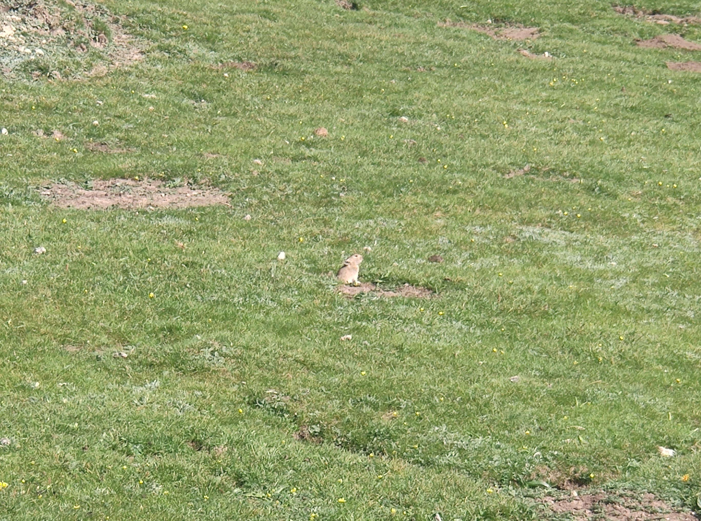
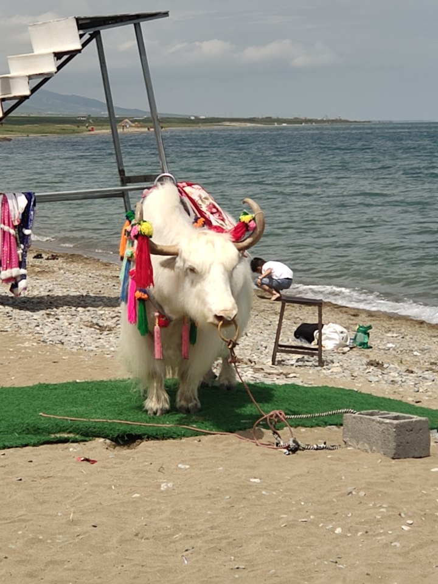

<!--more-->

日月山土拨鼠

青海湖

牦牛

&emsp;&emsp;土拨鼠活在当下，专心做好挖洞和把风工作。山上到处都是洞穴，可见土拨鼠的勤奋。作为人没必要刻意强调思考的独特性以与动物进行区分，不同动物有不同的智慧，所以他们能不断生存繁衍至今。倒不如作为人先承认自己是动物，活在当下，创造属于人类的智慧。

　　青海湖的浪潮接续不断，给人一种西西弗神话中反抗荒谬的力量。

　　牦牛鼻子上的鼻环，被牛主人暴力的拉扯，拉到各个位置和客人拍照挣钱，拉扯让鼻子都变了形状，可能这种情况几年如一日的发生，但牦牛没有放弃反抗，忍着鼻子剧痛违抗着主人的命令。

　　实践出真知，未经实践，不下定论。